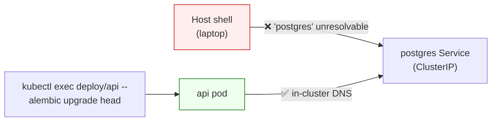

# Database migrations (Alembic, in-cluster)

Alembic migrations run **inside the `api` pod**, not on the host. The host has
no route to the `postgres` Service (it's a ClusterIP, resolved only by in-cluster
DNS), so any `alembic` command run from your laptop dies with
`socket.gaierror: Name or service not known`.

Running in-cluster also guarantees the migration uses the same code, models, and
DB driver as the deployed app — no drift between "what my laptop sees" and "what
the pod sees."



---

## One-time setup: bake migrations into the image

The backend image currently copies only `app/`. Alembic needs `alembic/` and
`alembic.ini` too, so add them to `backend/Dockerfile` after the `COPY app`
line:

```dockerfile
# Application code.
COPY app ./app
# Alembic migration scripts + config (so migrations can run in-cluster).
COPY alembic ./alembic
COPY alembic.ini ./alembic.ini
```

Then rebuild, load into kind, and restart the pods so they pick up the new image
(the image tag `:dev` is unchanged, so the Deployment won't restart on its own):

```bash
make k8s-load    # builds dpia-ros-backend:dev and loads it into the kind node
kubectl -n dpia-ros rollout restart deployment/api deployment/worker
kubectl -n dpia-ros rollout status deployment/api     # wait for "successfully rolled out"
```

You only repeat this when the Dockerfile or files under `alembic/` change — not
on every migration.

---

## Applying migrations

To run all pending migrations against the dev database:

```bash
kubectl -n dpia-ros exec deployment/api -- alembic upgrade head
```

The pod's working directory is `/app` (set by the image `WORKDIR`), which is
where `alembic.ini` lives. `env.py` reads the DB URL from `get_settings()`, so
`DATABASE_URL` comes from the `dpia-secrets` Secret (loaded via `envFrom`) — the
`sqlalchemy.url = ...placeholder` line in `alembic.ini` is ignored.

Other useful commands:

```bash
# Show current revision
kubectl -n dpia-ros exec deployment/api -- alembic current

# Show pending migrations
kubectl -n dpia-ros exec deployment/api -- alembic history
```

---

## Authoring migrations

Autogenerate runs against the live database, so it also must happen in-cluster.
The catch: the generated file lands *inside the pod*, so you copy it back to
your host before editing and committing.

```bash
# 1. Generate the migration inside the api pod.
kubectl -n dpia-ros exec deployment/api -- \
  alembic revision --autogenerate -m "create analyses table"

# 2. Find the filename it created (the <revision> part of the output).
kubectl -n dpia-ros exec deployment/api -- ls alembic/versions

# 3. Copy it back to your host working tree.
kubectl -n dpia-ros cp \
  deployment/api:/app/alembic/versions/<revision>_create_analyses_table.py \
  backend/alembic/versions/<revision>_create_analyses_table.py

# 4. Edit, review the upgrade()/downgrade() bodies, then commit.
```

After committing, apply it with the `alembic upgrade head` command above.

### ⚠️ Autogenerate produces empty migrations until `env.py` is fixed

`backend/alembic/env.py` sets `target_metadata = Base.metadata` on line 16, then
**overwrites it** with `target_metadata = None` on line 27. With `None`,
`--autogenerate` detects no tables and emits an empty migration.

To fix, delete line 27 (`target_metadata = None`) and make sure your models are
imported so they register on `Base.metadata` before `env.py` reads it — typically
by importing the model modules in `app/db/base.py`.

---

## Gotchas

- **Rebuild after model changes.** Models live in the image; a migration written
  against models that aren't in the running image will be wrong. If you've added
  models since the last `make k8s-load`, rebuild and `rollout restart` first.
- **`versions/` must exist.** Alembic expects `backend/alembic/versions/`. If
  you removed the `.gitkeep`, recreate the directory (Alembic won't create it).
- **Same-tag images don't auto-restart.** Because the image is tagged `:dev`
  with `imagePullPolicy: Never`, rebuilding alone doesn't update a running pod —
  you must `kubectl rollout restart` (see setup above).

---

## Suggested Make targets

The repo convention wraps in-cluster commands as Make targets (`backend-lint`,
`backend-test`). The natural additions, if you want them:

```makefile
backend-migrate: ## Apply pending Alembic migrations inside the api pod
> @kubectl -n $(NAMESPACE) exec deployment/api -- alembic upgrade head \
>   || echo "[make] api pod not ready — run 'make k8s-up' first"
```
